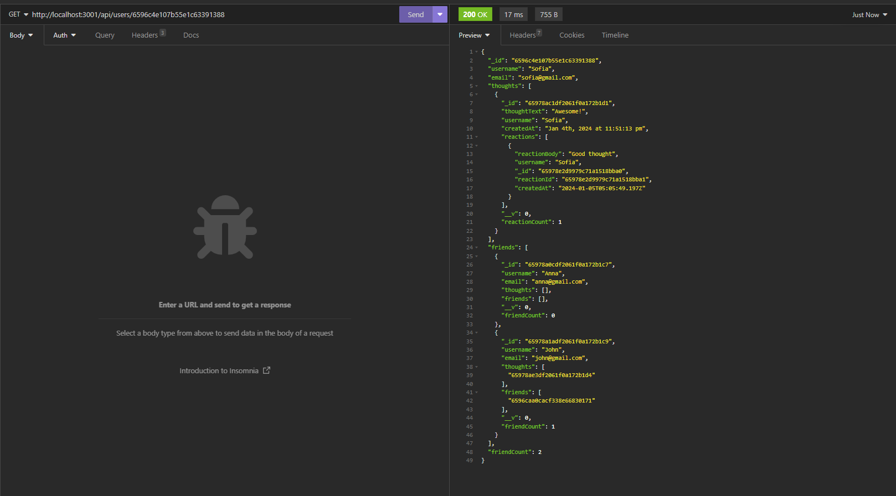
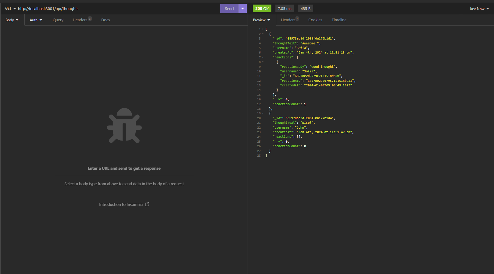

# NoSQL-Social-Network-API

## Description
NoSQL-Social-Network-API is a social network web application where users can share their thoughts, react to friends’ thoughts, and create a friend list.  
It uses Express.js, MongoDB and  Mongoose ODM.

## Installation
Before using the application make sure to run "npm i".  
Then run "npm start" to start the application.

## Usage
After all the installation is gone you can open Insomnia or any app that can handle API requests.  
You can make GET, POST, PUT or DELETE requests.

Video walk-through:  

[NoSQL-Social-Network-API-Video-walk-through]()

## License
Please refer to the LICENSE in the repo.
